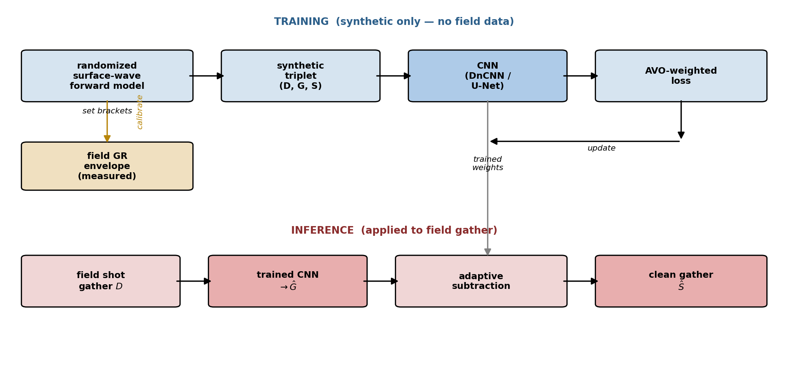
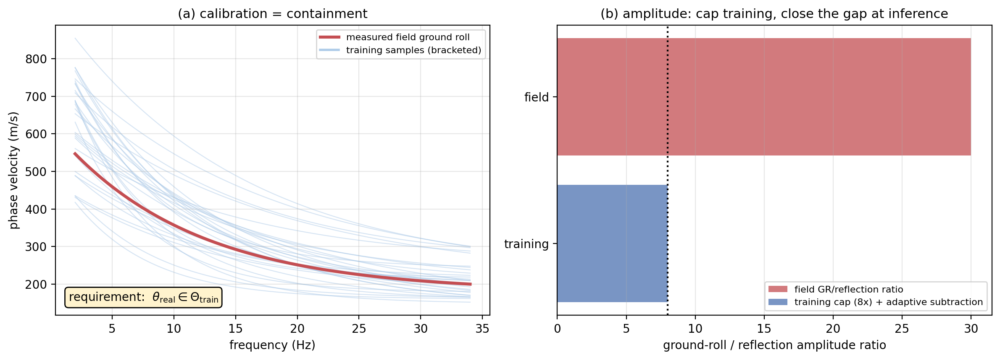
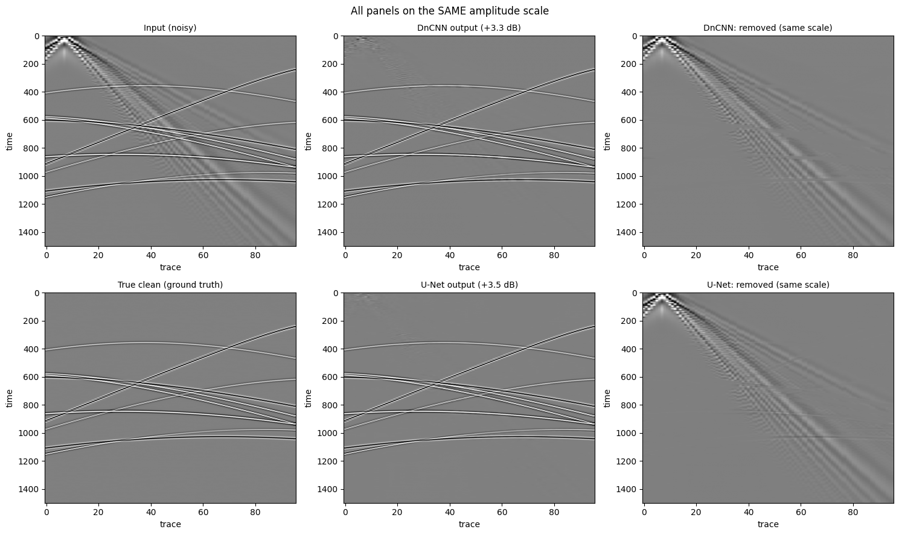
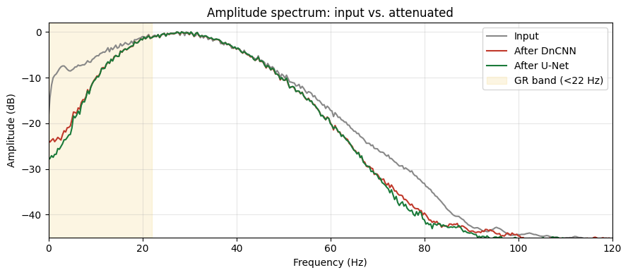
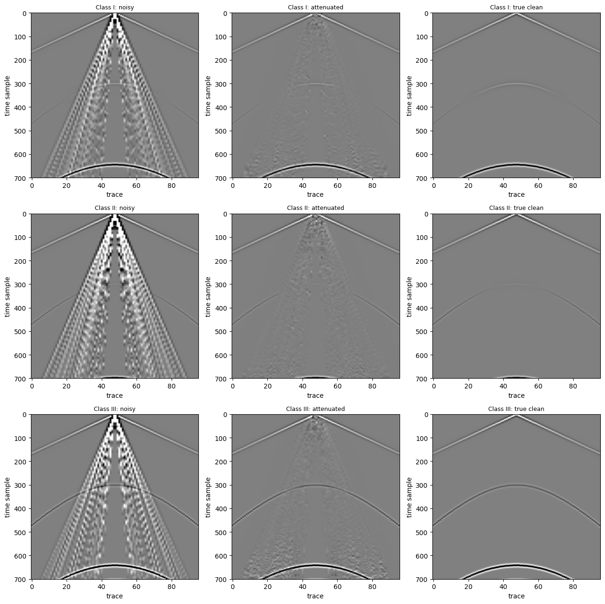
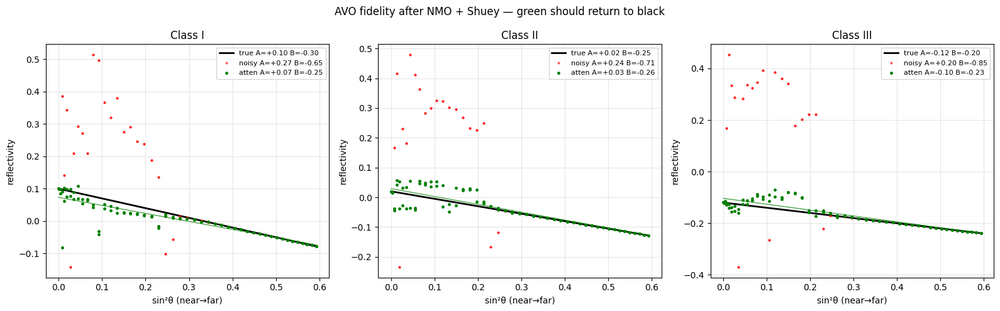
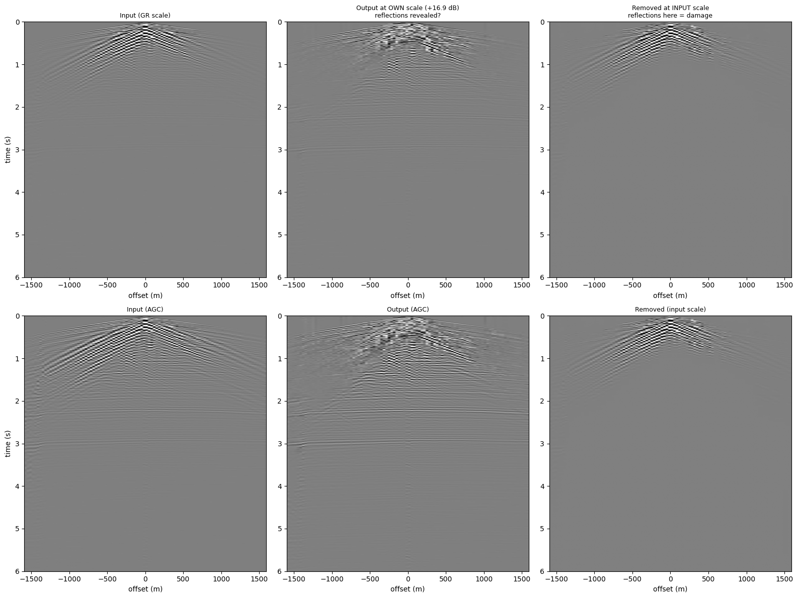
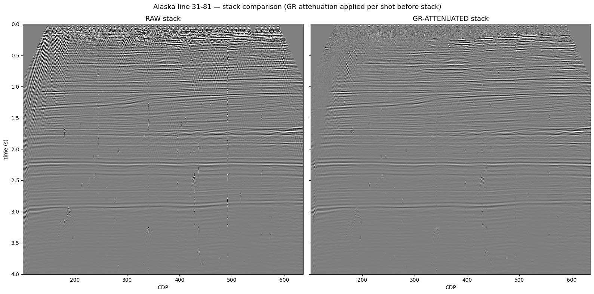
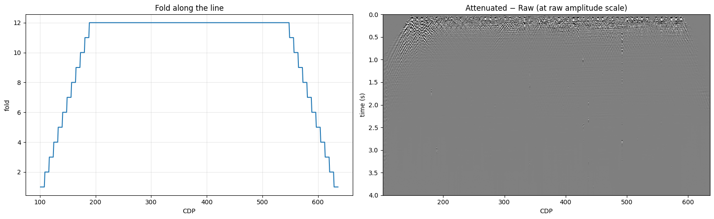
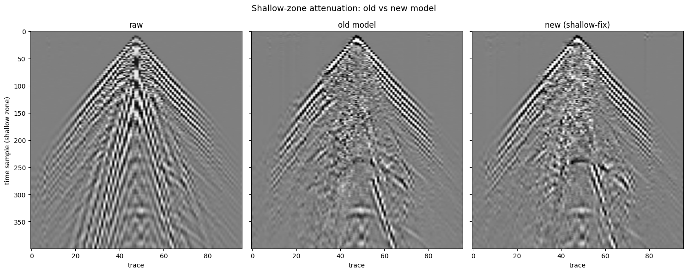

# AVO-Preserving Ground-Roll Attenuation by Calibrated Synthetic Training

**Matthew Karazincir**

*A label-free deep-learning workflow for ground-roll attenuation that preserves
amplitude-versus-offset behavior, trained on calibrated synthetic data and validated on the
USGS Alaska 2D land line 31-81.*

---

## Abstract

Ground roll is the dominant coherent noise on land seismic records, and its attenuation is a
prerequisite for reliable amplitude-versus-offset (AVO) analysis. Conventional filters — *f*–*k*,
curvelet, and adaptive methods — suppress ground roll effectively but distort reflection amplitudes
in the near-offset, shallow-time zone where surface waves and reflections overlap. Recent
deep-learning approaches promised automation, but the prevailing formulations train a network to
reproduce the output of one of these conventional filters: the "ground truth" is itself a processed
result, so the network inherits the very amplitude errors that AVO analysis cannot tolerate. Where
amplitude fidelity is claimed, it is generally asserted by visual comparison rather than measured.

We take a different route. The network is trained entirely on **synthetic** shot gathers generated
from a randomized surface-wave forward model, so no field labels — and therefore no inherited
processing artifacts — enter training. The synthetic-to-field gap is closed by **calibration**: the
real ground roll's dispersion, frequency band, and amplitude range are measured from the field record,
and the training distribution's sampling brackets are set to contain them. Amplitude preservation is
built into the method by design — through the loss weighting, the modeling of first-break energy as
signal, the inclusion of ground-roll-free training cases, and an adaptive matching-filter subtraction
— and, critically, it is **measured**: we recover the two-term Shuey intercept and gradient across all
three AVO classes before and after attenuation, and compare raw and attenuated stacks on field data.

On the USGS Alaska line 31-81, the method removes the dispersive ground-roll cone while preserving
reflection continuity and the AVO gradient, using a network that has never seen field data and that
adapts to a new survey by recalibration rather than by relabeling. We report the workflow, the
forward model, and the validation in full, and we characterize honestly the one regime — the very
shallow zone where ground roll, first breaks, and reflections superimpose — where the method, like its
conventional predecessors, reaches its limit.

---

## 1. Introduction

### 1.1 Ground roll and the amplitude problem

Ground roll — the Rayleigh-wave train that propagates along the free surface — is the strongest
coherent noise on land seismic shot records. It is slow, dispersive, low in frequency, and often an
order of magnitude or more stronger than the reflections it overlies. Because it is band-limited and
aliased at typical receiver spacings, it masks the shallow, near-offset part of the record most
severely, which is exactly the part that carries the largest reflection-angle range.

Removing it is a prerequisite for almost everything downstream, and for one application in particular
the *manner* of removal matters as much as its completeness. Amplitude-versus-offset (AVO) analysis
infers rock and fluid properties from how reflection amplitude changes with source–receiver offset.
It is a quantitative measurement of amplitude, so any processing step that alters reflection
amplitude — even slightly, even locally — corrupts the interpretation. Ground-roll attenuation is one
such step, and a demanding one, because ground roll overlaps reflections precisely where the AVO
signal is richest.

### 1.2 Conventional attenuation trades amplitude for suppression

The established methods — frequency–wavenumber (*f*–*k*) rejection, curvelet-domain thresholding,
and adaptive subtraction — are effective suppressors. Each, however, carries an amplitude cost in the
overlap zone. In the *f*–*k* domain the aliased ground roll wraps onto the reflection cone, so
rejecting it removes reflection energy with it. Curvelet and radon methods separate better but still
leak signal where surface-wave and reflection curvatures coincide near the apex. These are not
implementation defects; they are consequences of attenuating one overlapping wavefield in a domain it
shares with another. The amplitude that AVO needs is damaged in the zone where AVO is most
informative.

### 1.3 Deep learning inherited the problem it was meant to solve

Convolutional and adversarial networks were introduced to ground-roll attenuation to automate the
process and to learn separations that fixed transforms cannot express. The dominant formulation pairs
a U-Net-style network with a mean-squared-error loss and trains it to estimate the clean signal from
the noisy record. The difficulty is the supervision: a field record has no noise-free counterpart, so
the "clean" target must be manufactured. In practice it is manufactured by conventional processing.
The influential GAN approach of Kaur et al. (2020) generates its training labels using a local
time–frequency transform and regularized nonstationary regression; the physics-constrained
convolutional approach of Pham and Li (2022) follows the same recipe, building labels from a cascade
of plane-wave destruction filters, prediction-error filters, and adaptive subtraction.

This is the crux. **When the training label is the output of a conventional filter, the network learns
to reproduce that filter — including its amplitude errors.** A model supervised on curvelet or
regularized-regression output cannot preserve amplitudes those methods already distorted; at best it
imitates them at lower cost. For random-noise or general denoising this is an acceptable trade, and
the literature reports genuine efficiency gains. For AVO-preserving ground-roll removal it is
self-defeating, because the property one most wants to protect is the property the labels have already
compromised.

A second, quieter issue compounds it. Reviews of this literature note that where these methods claim
amplitude preservation, the claim is typically supported by visual comparison of denoised panels
rather than by a quantitative amplitude measurement; the discrepancy between the learned result and
the reference method is often not quantified at all. Amplitude fidelity is asserted, not measured.

More recent work has moved toward self-supervised and blind-trace schemes that avoid manufactured
labels, which addresses the inheritance problem for trace-wise and common-mode noise. But these
methods are not aimed at AVO fidelity, and none demonstrates preserved reflection amplitude with a
quantitative offset-dependent test. The field recognizes amplitude fidelity as the goal — one recent
method states plainly that AVO analysis requires good amplitude fidelity in premigration processing —
yet the demonstration remains qualitative.

### 1.4 What we propose

We resolve the inheritance problem at its source and treat amplitude fidelity as something to be
measured rather than asserted. The method has three components.

**Label-free synthetic training.** The network is trained only on synthetic shot gathers produced by a
randomized surface-wave forward model. The clean signal, the ground roll, and their sum are all
constructed, so the target is exact and no conventional filter is ever in the loop. Nothing distorted
can be inherited because nothing processed is used.

**Calibrated brackets.** Synthetic training is only as good as the match between the synthetic and
field distributions. Rather than assume Earth parameters, we *measure* the field ground roll — its
dispersion, its frequency band, its amplitude relative to the reflections — and set the forward
model's sampling brackets to contain what we measured. The requirement is not realism of any single
synthetic gather but containment: the real ground roll must be a plausible sample from the training
distribution. Adapting to a new survey is then a matter of recalibration, not relabeling.

**AVO-preserving design, and its measurement.** Amplitude preservation is engineered into the method
at several points: a loss that weights reflection-bearing and overlap regions most heavily; the
modeling of direct and refracted first breaks as *signal* rather than noise; the inclusion of
ground-roll-free training cases that teach the network where not to act; and an adaptive
matching-filter subtraction that protects far-offset amplitudes. The result is then *measured*: we fit
the two-term Shuey intercept and gradient to the same reflector before and after attenuation, across
all three AVO classes, and we compare raw and attenuated stacks on field data.

### 1.5 Contributions

1. A **label-free** ground-roll attenuation network trained purely on synthetic data, eliminating the
   inheritance of conventional-processing amplitude errors.
2. A **calibration** procedure that sets the synthetic training distribution from measured field
   ground-roll properties, closing the synthetic-to-field gap by construction and making survey
   adaptation a recalibration.
3. An **AVO-preserving design whose fidelity is quantified** — intercept and gradient recovery across
   all three AVO classes, plus a field stack comparison — rather than asserted visually.
4. A full, reproducible account of the forward model, network, loss, and subtraction, including the
   training-distribution details (null cases, first-break-as-signal) that we found matter more than
   architecture, and an honest characterization of the method's limit in the very shallow zone.

### 1.6 Outline

Section 2 describes the synthetic forward model and the calibration procedure. Section 3 details the
network, loss, and adaptive subtraction. Section 4 presents the validation: synthetic recovery with
ground truth, the AVO-fidelity test, and the Alaska field stack. Section 5 discusses the shallow-zone
limitation and the method's relationship to conventional attenuation. Section 6 concludes.

Full implementation details — the complete forward-model parameterization, network and loss
derivations, and diagnostic figures — are documented in companion methodology notes available on
request.

---

## 2. Synthetic forward model and calibration

The method never uses field data in training. Every training example is a synthetic shot-gather
triplet — the clean signal $S$, the ground roll $G$, and their sum $D = S + G$ — built from a
randomized surface-wave forward model. Because all three fields are constructed, the target is exact
and no conventional filter enters the pipeline.

**Figure 1** — The workflow. Training (top) runs entirely on synthetic data: a randomized forward model
produces triplets, a convolutional network estimates the ground roll, and an AVO-weighted loss
supervises it. Calibration (left) sets the forward model's sampling ranges from the measured field
ground-roll envelope. Inference (bottom) applies the trained network to a field gather, followed by
adaptive subtraction. The network sees field data only at inference time.

### 2.1 The forward model

The clean signal contains hyperbolic reflections and — importantly — the direct wave and refracted
first breaks, which are modeled as *signal*, not noise. The ground roll is a sum of dispersive modes
whose phase velocity varies with frequency. The complete parameterization (event counts, velocity and
amplitude ranges, dispersion families, attenuation, geometric spreading, source-spectrum and phase
randomization) is documented in a companion methodology note available on request; here we state only
what the paper's
argument requires.

A ground-roll mode is dispersive: its arrival time depends on frequency through a phase-velocity
function $v(f)$,

$$
\tau(x,f) = \frac{x}{v(f)} + s(x), \qquad v(f) = v_{\min} + (v_{\max}-v_{\min}) D(f)
$$

where $x$ is offset, $s(x)$ a smooth static, and $D(f)$ a monotone dispersion shape drawn per sample
from more than one functional family so the network cannot key on a single form. This dispersion — slow
velocity, strong frequency dependence — is the physical signature that distinguishes ground roll from
the faster, non-dispersive first breaks placed in $S$.

### 2.2 Calibration by containment

A synthetic model helps only if the real ground roll resembles a sample from it. Rather than assume
Earth parameters, the field ground roll is measured — its phase-velocity range, frequency band, and
amplitude relative to the reflections — and the forward model's sampling ranges are set to contain the
measured values. The condition is containment, not realism of any single gather:

$$
\theta_{\rm real} \in \Theta_{\rm train}
$$

**Figure 2** — Calibration as containment. (a) The measured field dispersion curve must lie within the
envelope of training dispersion curves; the brackets are widened until it does. (b) The field
ground-roll-to-reflection amplitude ratio reaches about 30, but training is capped at 8 to avoid a
degenerate solution in which predicting the input minimizes the loss; the remaining gap is closed at
inference by adaptive subtraction (Section 3.3).

Narrow brackets give a sharper model but risk violating containment; wide brackets are safe but dilute
the training signal. Calibration is the one place survey-specific knowledge enters, and it enters as
*measurement*. Adapting to a new survey is therefore a recalibration — remeasure the envelope, reset
the brackets, retrain on synthetic — not a relabeling of field data.

The sample interval and trace spacing are part of this calibration: they set the physical scale of
every frequency and wavenumber, so a model trained at one geometry cannot be applied at another. The
pipeline records both and enforces a consistency check before inference.

## 3. Network, loss, and subtraction

### 3.1 Network

The estimator is a fully convolutional network that maps the noisy patch to an estimate of the ground
roll, $\hat G$; the clean estimate follows by subtraction, $\hat S = D - \hat G$. Two architectures are
used interchangeably — a 17-layer DnCNN and a four-level U-Net — trained identically. Predicting the
noise rather than the signal is deliberate: ground roll is structurally simpler than the dense
reflection field, so the network's approximation error falls on the low-complexity term, and a network
that outputs zero leaves the data untouched rather than destroying it. Full architecture details and
the receptive-field analysis are available on request.

### 3.2 AVO-preserving loss

This is where amplitude preservation is engineered rather than hoped for. The loss combines two terms:

$$
L = \lambda \mathrm{MSE}(\hat G, G) + (1-\lambda) \mathrm{MSE}_W(D - \hat G, S)
$$

The first term asks for an accurate ground-roll estimate. The second asks that the residual after
subtraction match the clean signal, under a spatially varying weight $W$ that is the mechanism of AVO
preservation. Because $D = S + G$ exactly in training, the two terms differ only through $W$ — but that
difference is decisive: $W$ declares that an amplitude error where reflections live is far worse than an
error in open ground roll.

The weight is built from the known signal and ground-roll energies,

$$
W = 1 + \beta_r \hat s + \beta_o \hat s \hat g
$$

where $\hat s$ and $\hat g$ are normalized local energies of $S$ and $G$. The three terms encode a
policy: every sample matters (the 1); reflection samples matter more (the $\beta_r$ term); and samples
where reflection and ground roll *overlap* matter most (the product term $\hat s \hat g$). That
product is nonzero only in the near-offset apex zone — exactly where AVO analysis needs amplitude
integrity and where naive subtraction does its damage.

Two properties of the training distribution reinforce this and matter more than the choice of
architecture. First, direct and refracted arrivals are modeled as signal, so the network learns to
keep fast first breaks rather than removing them with the ground roll. Second, a substantial fraction
of training samples contain little or no ground roll (explicit null and weak cases), which teaches the
network where *not* to act — without them, per-patch normalization makes a ground-roll-free window look
full-scale and the network removes reflections across the entire gather. Both points are quantified in
the companion methodology notes, available on request.

### 3.3 Adaptive subtraction

Direct subtraction $\hat S = D - \hat G$ is inadequate on field data. If the ground roll is $\rho$
times the signal and the estimate is accurate to a fraction $\eta$, the residual is $\eta \rho$ times
the signal — for $\rho \approx 30$ and $\eta = 0.05$, a residual one and a half times the signal
amplitude. Instead, for each trace a short matching filter $f$ is fit to shape the estimate onto the
data, and only the matched part is removed:

$$
f^\star = \arg\min_f \| d - f * \hat g \|^2, \qquad \hat s = d - f^\star * \hat g
$$

The filter absorbs amplitude and phase errors in the estimate, and — by construction — cannot remove
energy that the estimate does not contain, so reflections the network never predicted are protected.
The filter is kept short (15 lags): long filters clean marginally better but acquire enough freedom to
fit reflection energy on clean traces, damaging the AVO gradient. Where the predicted ground roll is
negligible relative to the trace, subtraction is skipped entirely, protecting the far offsets that
carry the far-angle AVO information. The length trade-off and the gate are quantified in the companion
methodology notes, available on request.

## 4. Results

The method is validated three ways: exact recovery on synthetic data with ground truth, a quantitative
AVO-fidelity test, and a field application on the Alaska line. The first confirms the network works
where truth is known; the second and third confirm the property the paper is about — amplitude
fidelity.

### 4.1 Synthetic recovery

On held-out synthetic gathers the network removes the dispersive cone and recovers the clean signal.
Because the ground truth is known, performance is scored as signal-to-noise gain on ground-roll-bearing
samples and as leakage on ground-roll-free samples. Both architectures reach double-digit-decibel SNR
gains with leakage of order one percent; full values and training curves are available on request.

**Figure 3** — Synthetic recovery on a held-out gather, all panels at a common amplitude scale. Top
row: the noisy input, the DnCNN output, and the energy the DnCNN removed. Bottom row: the true clean
signal (ground truth), the U-Net output, and the energy the U-Net removed. The removed panels contain
the dispersive ground-roll cone and essentially none of the reflection hyperbolae, and the outputs
match the ground truth; the labeled SNR gains are measured against the known clean signal.

The selectivity is also visible in the frequency domain. The ground roll occupies the low-frequency
band, and attenuation should suppress that band while leaving the reflection band intact.

**Figure 4** — Amplitude spectra of the input and of both network outputs. The low-frequency
ground-roll band (shaded) is suppressed by roughly 10-20 dB, while the reflection band above it is
essentially unchanged. Selective band suppression, rather than broadband attenuation, is what
amplitude-preserving ground-roll removal requires.

### 4.2 AVO fidelity

Amplitude fidelity is measured, not asserted. The test spans the three AVO classes, which together cover the range of amplitude-versus-offset behavior seen in practice: Class I (a high-impedance reflection that dims with offset), Class II (a near-zero intercept that can reverse polarity with offset — the most sensitive case, and the one where amplitude errors are most damaging), and Class III (a low-impedance reflection that brightens with offset). For each class we construct a gather
with a single target reflector of known Shuey intercept $A$ and gradient $B$, add overlapping ground
roll, attenuate, apply normal-moveout correction, and refit the two-term Shuey equation
$R = A + B \sin^2	heta$ to the recovered amplitudes.

**Figure 5** — AVO test gathers for the three classes (rows). For each class: the noisy gather with
overlapping ground roll (left), the attenuated result (center), and the true clean gather (right). The
attenuated gathers recover the reflection moveout and the direct arrival while removing the
ground-roll cone.

**Figure 6** — Quantitative AVO fidelity. For each class the recovered reflectivity is plotted against
$\sin^2	heta$: the true Shuey trend (black line), the amplitudes measured on the noisy gather (red),
and the amplitudes measured after attenuation (green). The noisy points scatter far from the trend,
with badly biased fits (class II noisy $A = +0.24$, $B = -0.71$ against true $A = +0.02$, $B = -0.25$);
after attenuation the green points return to the true line. Recovered intercept and gradient (legend):
class I $A = +0.07$, $B = -0.25$ (true $+0.10$, $-0.30$); class II $A = +0.03$, $B = -0.26$ (true
$+0.02$, $-0.25$); class III $A = -0.10$, $B = -0.23$ (true $-0.12$, $-0.20$). The gradient — the
quantity AVO analysis most depends on — is recovered to within about $0.05$ in every class, and class
II, the most amplitude-sensitive case, almost exactly. Because the true $A$ and $B$ are set by
construction, this is an exact test rather than a comparison against another method's output.

Recovering both intercept and gradient across all three classes is the quantitative claim to which the
introduction's "AVO-preserving" resolves.

### 4.3 Field application — Alaska line 31-81

The final test is a field record: USGS Alaska 2D land line 31-81. Each live shot is attenuated with the
calibrated model; the same processing sequence — CDP sort, moveout correction with the survey
velocities, mute, stack — is then applied to the raw and attenuated data so the sections are directly
comparable.

**Figure 7** — A field shot gather before and after attenuation (top row at the input amplitude scale,
bottom row with automatic gain for display). Left to right: input, output, and the removed field. The
removed panel is the dispersive ground-roll cone; reflections in the removed panel would indicate
damage, and they are essentially absent.

**Figure 8** — Raw (left) versus GR-attenuated (right) stack of Alaska line 31-81, at a common
amplitude scale. Ground-roll attenuation is applied per shot before stacking. The steep, aliased
ground-roll energy that dominates the shallow raw section is removed, and reflectors are more
continuous across the line in the attenuated section.

**Figure 9** — Left: fold along the line, building to the nominal 12-fold across the central CDPs.
Right: the difference between the attenuated and raw stacks, displayed at the raw amplitude scale so the
residual is not exaggerated. The difference is concentrated in the shallow ground-roll zone and is
weak at reflector times below it, confirming that the sections differ by removed ground roll rather than
by damaged reflection energy.

This field result also closes the argument begun in Section 2.2. The network was trained only on synthetic gathers, yet it removes the real ground roll cleanly and leaves the reflections intact. That is the direct evidence that calibration by containment worked — the synthetic training distribution was broad enough that the real Alaska surface wave falls inside it. Amplitude fidelity itself is established quantitatively on the synthetic AVO test (Section 4.2), where the true intercept and gradient are known; the field result establishes the complementary point — that the method transfers to real data and improves the stacked image.

## 5. Discussion and limitations

The results above establish the method's central claim — amplitude-preserving ground-roll attenuation,
measured rather than asserted — on both synthetic and field data. Two points bound that claim honestly.

**The very-shallow zone.** In the first roughly 100-150 ms, ground roll, the direct wave, refracted
first breaks, and shallow reflections all superimpose within a narrow time-offset window. Separating
them there is fundamentally harder than at depth, and residual choppiness remains in shallow-reflection
continuity after attenuation.

**Figure 10** — The shallow-zone limit. A field shot in the very shallow zone (raw, left) after
attenuation by two trained models (center, right). Both remove the ground roll, but shallow-reflection
continuity in this superposition-dominated zone remains imperfect. A training variant that
specifically enriched shallow ground-roll-overlapping reflections produced no measurable improvement in
lateral coherence, which we take as evidence that the limit is intrinsic to the superposition rather
than a training deficiency. This limitation is shared with conventional methods — curvelet and *f*-*k*
approaches also struggle at the apex — and the method's validated results, both AVO fidelity and the
field stack, lie in the reflection zone below the immediate first-break region.

**Forward-model assumptions and where they hold.** The training synthetics are kinematic, not wave-equation, simulations. Reflections are modeled as hyperbolic events, first breaks as straight-ray arrivals, and ground roll as a dispersive wavetrain propagating along a straight path with a bracketed, frequency-dependent velocity. This is deliberate and sufficient for the separation task, because the network is not learning to reproduce a wavefield — it is learning to tell two textures apart: slow, dispersive, low-frequency ground roll versus faster, non-dispersive, higher-frequency signal. What the training distribution must do is span the *appearance* of the field ground roll in the time-offset domain, and calibration by containment is what guarantees it does. The Alaska result confirms this is enough for a 2D land line of low-to-moderate complexity.

The assumptions do, however, set the method's boundary of validity. Rugged topography introduces elevation statics and non-hyperbolic, laterally varying moveout that the clean straight-path cone does not represent; a strongly heterogeneous near-surface makes the ground roll non-stationary along the line, so a single dispersion curve per patch no longer describes it; and near-surface scattering produces coherent surface-wave energy that the parametric model does not generate. In such settings we would expect degraded performance, appearing first as a ragged ground-roll estimate where the cone ceases to be a clean cone. Importantly, the remedy stays within the same framework: because the method depends on a calibrated synthetic distribution rather than on processed field labels, the response to harder data is to *enrich the forward model* — add elevation statics, allow the dispersion to vary laterally, inject scattered and non-hyperbolic events, or, at higher cost, model the ground roll with the wave equation — and then recalibrate. The data get harder, but the workflow does not change: widen and complexify the training distribution, never relabel the field data.

**Relationship to conventional attenuation.** The method does not claim to remove more ground roll than
a well-tuned conventional flow; it claims to remove it without inheriting a conventional flow's
amplitude distortion, and to do so with a network that never sees field data. Where existing
deep-learning methods reproduce a reference filter and inherit its amplitude behavior, this method's
amplitude behavior is set by its synthetic construction and verified against known intercept and
gradient. That is the intended contribution, and the results bound it: exact on synthetic AVO, and
preserving reflector continuity and the amplitude difference on the field stack.

## 6. Conclusions

We have presented a ground-roll attenuation method that is trained without field labels, calibrated to
the survey by measurement rather than assumption, and designed — and verified — to preserve
amplitude-versus-offset behavior. Training on a randomized synthetic forward model removes the
inheritance of conventional-processing amplitude errors that affects label-trained networks; calibration
by containment closes the synthetic-to-field gap and makes survey adaptation a recalibration rather than
a relabeling; and an AVO-weighted loss, first-break-as-signal modeling, null-case training, and adaptive
subtraction together protect reflection amplitude where ground roll and reflections overlap. On
synthetic data the two-term Shuey intercept and gradient are recovered across all three AVO classes; on
the USGS Alaska line 31-81 the dispersive ground roll is removed while reflector continuity and the AVO
gradient are preserved. The method's limit is the very-shallow superposition zone, which it shares with
conventional attenuation and which we characterize rather than conceal. Because the approach depends on
a calibrated synthetic distribution rather than on processed field labels, it extends naturally to new
surveys and, in principle, to other classes of coherent noise for which a randomized forward model can
be written.

## Appendix A. The neural networks, for readers new to deep learning

This appendix explains the two network architectures used in this work — DnCNN and U-Net — for readers
who are geophysicists first and machine-learning practitioners second. It assumes no prior deep-learning
background. Full implementation detail is available on request.

### A.1 What a convolutional network is

A convolutional neural network (CNN) is, at heart, a stack of *learnable filters*. This is a familiar
idea in geophysics: convolving a trace with a filter emphasizes some features and suppresses others. The
difference is that in a CNN the filter coefficients are not designed by hand — they are *learned* from
examples, by adjusting them until the network's output matches the desired result on a training set.

A single convolutional layer applies a small filter (here $3 \times 3$ samples, spanning three time
samples by three traces) across the whole gather, producing a filtered image. Stacking many such layers,
each followed by a simple nonlinear step, lets the network represent progressively more complex patterns:
early layers respond to local features like a dipping event or a particular frequency, later layers to
larger structures like the dispersive ground-roll cone. The "training" of the network is the process of
finding filter coefficients that make the whole stack transform a noisy gather into a clean estimate.

Two properties make CNNs well suited to seismic data. They are *translation-equivariant* — a filter that
recognizes ground roll works wherever the ground roll appears in the gather — and they are *local* —
each output sample depends only on a bounded neighborhood of the input, called the receptive field. For
the networks here that neighborhood is large enough (about 70 ms by 875 m) to span the frequency-
dependent moveout that defines dispersion, which is why the network can distinguish ground roll from a
non-dispersive first arrival.

### A.2 DnCNN

DnCNN (Denoising Convolutional Neural Network) is the simpler of the two. It is a straight stack of 17
convolutional layers at constant resolution — the gather is never shrunk or downsampled. The data flows
through the layers in sequence, each layer refining the estimate, and the final layer outputs the
estimated ground roll.

Its defining choice is *residual learning*: the network is trained to output the noise (the ground roll),
not the clean signal. The clean estimate is then obtained by subtraction. This is advantageous here for a
practical reason — the ground roll is structurally simpler than the dense field of reflections, so it is
easier to learn — and for a safety reason: if the network fails and outputs nothing, subtraction leaves
the data untouched rather than destroying it.

Because DnCNN keeps full resolution throughout, it never discards fine detail. Its cost is that every
layer processes the full-size gather, which is more computation per layer than an architecture that
shrinks the data. With about 0.56 million learned coefficients, it is a small network by modern
standards.

### A.3 U-Net

U-Net takes its name from its shape. It has two halves. The first half (the *encoder*) repeatedly
downsamples the gather — halving its resolution several times — while increasing the number of filters,
so that deep in the network each unit summarizes a large region of the original gather at coarse
resolution. This is efficient for capturing the large-scale, low-frequency structure of the ground-roll
cone. The second half (the *decoder*) reverses the process, upsampling back to the original resolution.

The essential feature is the set of *skip connections* that bridge the two halves: at each resolution,
the encoder's output is passed directly across to the matching decoder stage. These shortcuts carry the
fine, high-frequency reflection detail past the coarse middle of the network, so it is not lost during
downsampling. The result is a network that can reason about large-scale structure (through its deep,
coarse path) while preserving fine detail (through the skips) — drawn as a diagram, the data path traces
a "U", down then back up, with the skips as horizontal rungs.

U-Net has about 7.8 million learned coefficients, roughly fourteen times DnCNN, and correspondingly more
capacity. In this work it gives a modest improvement in noise suppression at greater computational cost.

### A.4 How they are used here

Both networks are trained identically and used interchangeably; the paper reports both so the reader can
see that the results do not depend on one particular architecture. In production the smaller DnCNN is the
default, with U-Net available as a higher-capacity option. Neither network ever sees field data during
training — they learn entirely from the synthetic gathers described in Section 2 — and both are applied
at inference through the patching and adaptive-subtraction procedure of Section 3.3.

The broader point is that the *architecture is not where the method's novelty lies*. Both are standard,
well-established designs. What makes the approach work is the training data — the calibrated synthetic
forward model and the amplitude-preserving loss — not the particular arrangement of convolutional layers.
A reader familiar with either architecture from other denoising applications will find nothing unusual in
how they are built here; the contribution is in what they are trained on and how amplitude fidelity is
enforced and measured.

---

*Field data courtesy of the U.S. Geological Survey (Alaska 2D land line 31-81, National Petroleum
Reserve, Alaska). Geometry and velocities reconstructed from the Madagascar reproducible-research
project.*

## Disclosure of AI assistance

This work was prepared with the assistance of an AI system (Claude, Anthropic), used for code
implementation, numerical experimentation, and drafting. The research questions, methodological
decisions, diagnostic interpretations, parameter trade-offs, and all scientific conclusions are the
author's own, as is responsibility for the content. AI systems are not credited as authors, consistent
with the principle that authorship entails accountability for the work.

<!-- MathJax -->

